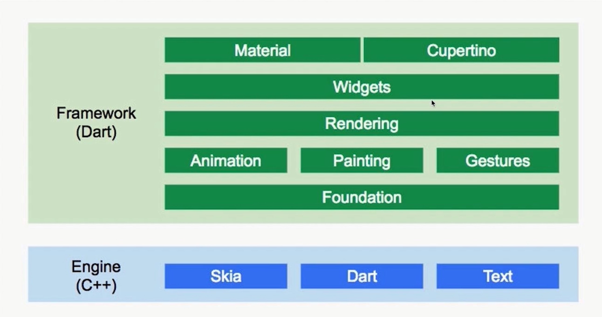

##### Flutter框架

##### Dart线程模型

##### Dart线程管理

##### Flutter生命周期

##### Flutter编译方式

##### 页面导航管理
Navigator 2.0相比1.0
- 1.0只提供了push/pushNamed/pop等简单的API。不方便压入或弹出多个页面
- 1.0难以实现对栈内中间页面的移除，交换等操作

##### Flutter核心渲染机制：增量渲染

- 三棵树
    - WidgetTree树:存放渲染内容、它只是一个配置数据结构，创建是非常轻量的，在页面刷新的过程中随时会重建
    - Element:是分离 WidgetTree 和真正的渲染对象的中间层， WidgetTree 用来描述对应的Element 属性,同时持有Widget和RenderObject，存放上下文信息，通过它来遍历视图树，支撑UI结构
    - RenderObject树: (渲染树)用于应用界面的布局和绘制，负责真正的渲染，保存了元素的大小，布局等信息，实例化一个 RenderObject 是非常耗能的

